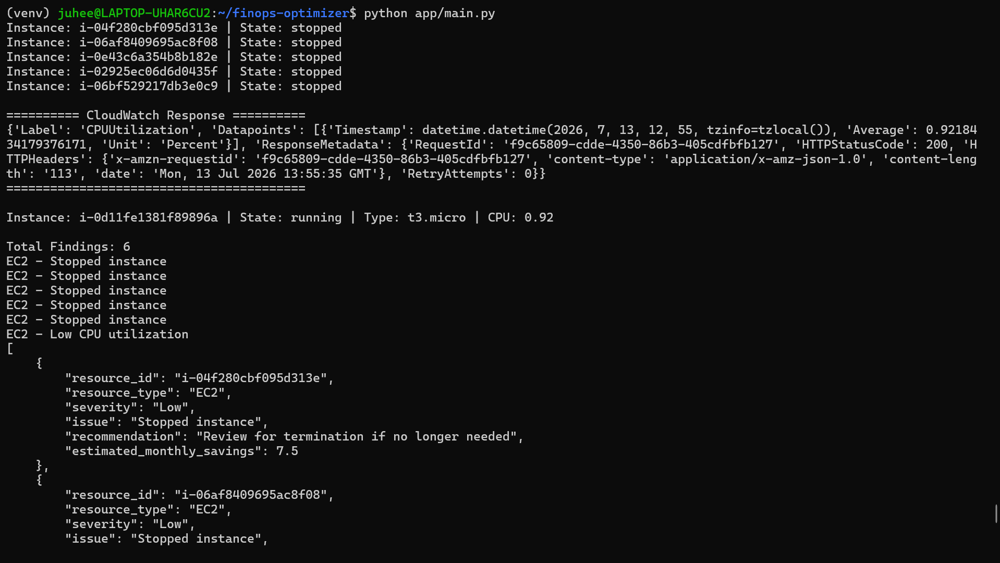
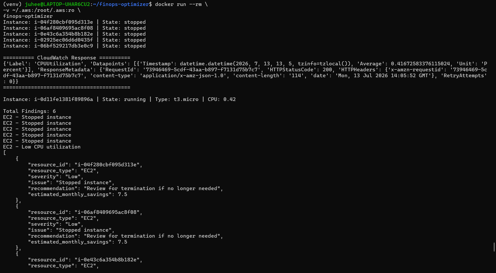
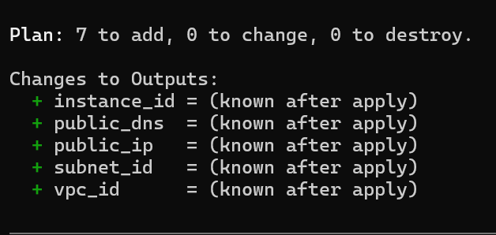
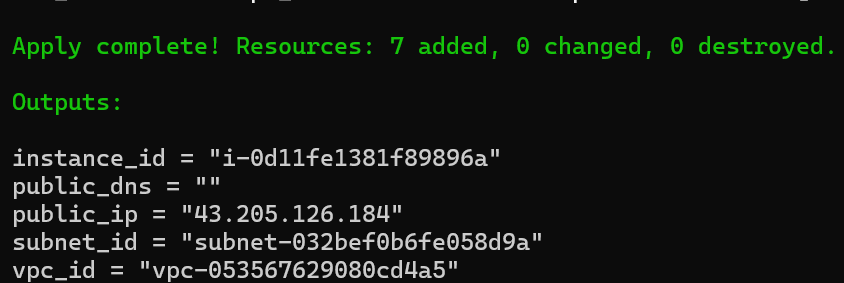
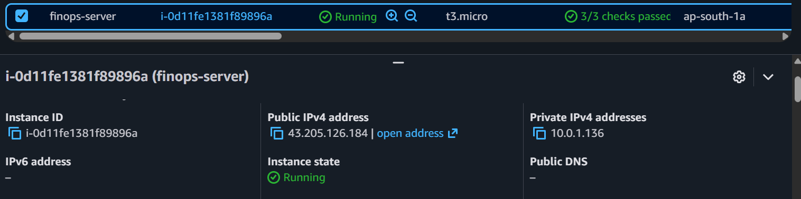
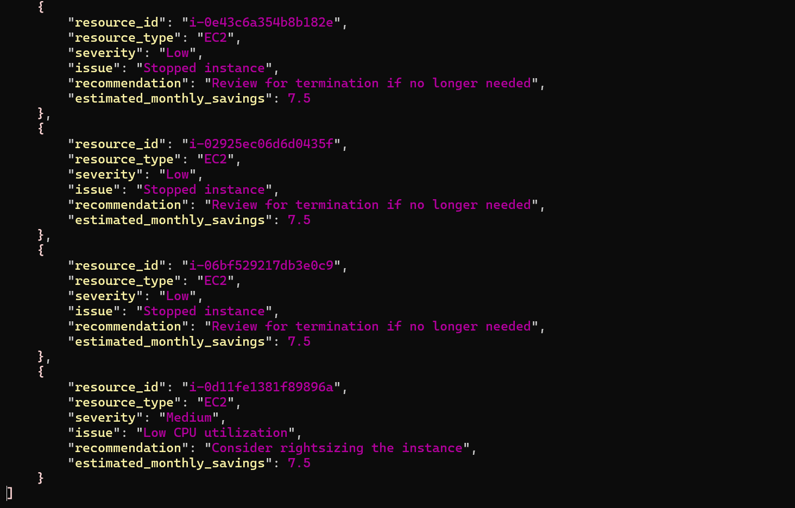

# FinOps Optimizer
> A Cloud Cost Optimization platform built with Python, AWS, Docker, and Terraform that automatically analyzes AWS resources and generates actionable FinOps 
recommendations.

------------------------------------------------------------------------

## Overview

Cloud environments often contain idle or underutilized resources that unnecessarily increase operational costs. Manually identifying these inefficiencies is time-consuming and prone to oversight.

**FinOps Optimizer** automates this process by discovering AWS resources, analyzing their utilization using the AWS SDK (`boto3`), applying FinOps optimization rules, estimating potential monthly savings, and generating actionable recommendations in a structured JSON report.

This project demonstrates practical Cloud and DevOps skills through the implementation of Infrastructure as Code (Terraform), containerization (Docker), AWS automation, and Python-based cloud resource analysis.

 **Developed as a portfolio project to demonstrate Cloud Computing, DevOps, and FinOps practices using AWS.**

------------------------------------------------------------------------

# Problem Statement

Cloud environments often contain idle, underutilized, or forgotten resources that continue to incur unnecessary costs. Identifying these resources manually becomes increasingly difficult as cloud infrastructure grows, making cost optimization a continuous challenge for organizations.

The objective of this project is to automate the discovery and analysis of AWS resources, identify potential cost-saving opportunities, and provide actionable recommendations using FinOps best practices.

By combining AWS APIs, Python automation, Docker, and Terraform, this project demonstrates how cloud infrastructure can be analyzed and managed efficiently while promoting Infrastructure as Code (IaC) and modern DevOps practices.

---------------------------------------------------------------------------


# Features

| Feature | Description |
|----------|-------------|
| **AWS Resource Discovery** | Automatically discovers EC2 instances, EBS volumes, and EBS snapshots within the configured AWS region. |
| **EC2 Analysis** | Identifies stopped EC2 instances and detects underutilized instances using CloudWatch CPU utilization metrics. |
| **EBS Volume Analysis** | Detects unattached EBS volumes that may be generating unnecessary storage costs. |
| **Snapshot Analysis** | Identifies snapshots that can be reviewed for cleanup and storage optimization. |
| **Cost Estimation** | Estimates potential monthly savings for identified optimization opportunities. |
| **Recommendation Engine** | Applies FinOps rules to generate actionable optimization recommendations. |
| **JSON Report Generation** | Generates structured JSON reports containing findings and recommendations. |
| **Docker Support** | Containerized application for consistent deployment across environments. |
| **Infrastructure as Code** | Uses Terraform to provision AWS infrastructure including VPC, networking, security groups, and EC2 instances. |
| **AWS SDK Integration** | Uses the AWS SDK (`boto3`) for secure interaction with AWS services. |

------------------------------------------------------------------------

# Tech Stack

| Category | Technologies |
|-----------|--------------|
| **Programming Language** | Python 3 |
| **Cloud Platform** | Amazon Web Services (AWS) |
| **Cloud SDK** | boto3 |
| **Infrastructure as Code** | Terraform |
| **Containerization** | Docker |
| **Version Control** | Git & GitHub |
| **Monitoring** | Amazon CloudWatch |
| **Operating System** | Ubuntu (WSL) |

------------------------------------------------------------------------

# Project Structure

``` text
finops-optimizer/
│
├── app/
│   ├── analyzers/
│   ├── engine/
│   ├── models/
│   ├── services/
│   ├── utils/
│   └── main.py
│
├── terraform/
├── reports/
├── assets/
│   ├── architecture/
│   └── screenshots/
├── Dockerfile
├── requirements.txt
└── README.md
```

------------------------------------------------------------------------

# 🏗️ Architecture

The FinOps Optimizer follows a modular architecture where AWS resources are discovered using the AWS SDK (`boto3`), analyzed by dedicated optimization modules, and processed through a recommendation engine to generate structured cost optimization reports.
``` text
Terraform
      │
      ▼
AWS Infrastructure
      │
      ▼
AWS SDK (boto3)
      │
      ▼
Recommendation Engine
      │
      ├── EC2 Analyzer
      ├── EBS Analyzer
      └── Snapshot Analyzer
      │
      ▼
JSON Report
```

------------------------------------------------------------------------
# ⚙️ Installation

Clone the repository:

```bash
git clone https://github.com/Juhee2306/finops-optimizer.git
cd finops-optimizer
```

Create a virtual environment:

```bash
python -m venv venv
```

Activate the virtual environment:

**Linux / macOS**

```bash
source venv/bin/activate
```

**Windows**

```powershell
venv\Scripts\activate
```

Install dependencies:

```bash
pip install -r requirements.txt
```
Ensure your AWS CLI is configured with valid credentials before running the application.

Configure your AWS credentials:

```bash
aws configure
```

Run the application:

```bash
python app/main.py
```
------------------------------------------------------------------------
# 🐳 Docker

Build the Docker image:

```bash
docker build -t finops-optimizer .
```

Run the container:

```bash
docker run --rm \
-v ~/.aws:/root/.aws:ro \
finops-optimizer
```
------------------------------------------------------------------------
# ☁️ Infrastructure Provisioning with Terraform

Initialize Terraform:

```bash
terraform init
```

Validate the configuration:

```bash
terraform validate
```

Preview the infrastructure:

```bash
terraform plan
```

Provision the infrastructure:

```bash
terraform apply
```

Destroy the infrastructure:

```bash
terraform destroy
```
------------------------------------------------------------------------
# 📊 Sample Output

```json
[
  {
    "resource_type": "EC2",
    "issue": "Stopped instance",
    "recommendation": "Review for termination if no longer needed",
    "estimated_monthly_savings": 7.5
  }
]
```
------------------------------------------------------------------------
# 📸 Screenshots

## Application Execution



---

## Docker Execution



---

## Terraform Plan



---

## Terraform Apply



---

## AWS EC2 Deployment



---

## Generated JSON Report



------------------------------------------------------------------------
# Future Enhancements

- Add support for additional AWS services such as S3, RDS, and Lambda.
- Export reports in CSV, HTML, and PDF formats.
- Develop a web-based dashboard for report visualization.
- Integrate AWS Cost Explorer for enhanced cost analysis.
- Schedule automated scans using EventBridge or cron jobs.
- Add email notifications for optimization reports.

------------------------------------------------------------------------

# Author

**Juhee Lavanya**

Cloud Computing Undergraduate \| Aspiring Cloud & DevOps Engineer

LinkedIn: 

GitHub: 


